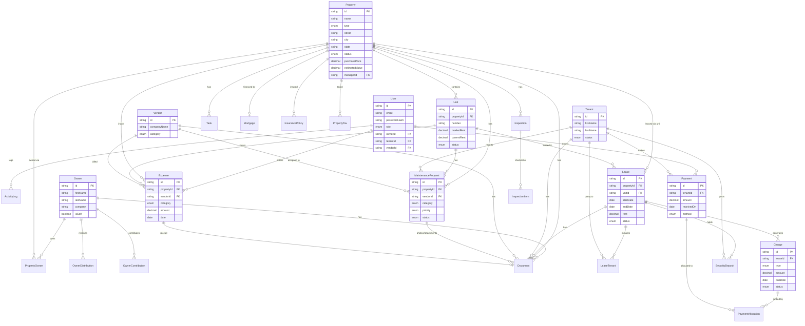

# ERD — RentalPM Entity Relationship Diagram

```mermaid
erDiagram
    User ||--o{ ActivityLog : logs
    User ||--o{ Payment : enters
    User ||--o{ Expense : enters

    Owner ||--o{ PropertyOwner : owns
    Owner ||--o{ OwnerDistribution : receives
    Owner ||--o{ OwnerContribution : contributes
    Owner ||--o{ Document : has

    Property ||--o{ PropertyOwner : "owned via"
    Property ||--o{ Unit : contains
    Property ||--o{ Expense : incurs
    Property ||--o{ MaintenanceRequest : has
    Property ||--o{ Inspection : has
    Property ||--o{ Task : has
    Property ||--o{ Document : has
    Property ||--o| Mortgage : "financed by"
    Property ||--o{ InsurancePolicy : insured
    Property ||--o{ PropertyTax : taxed
    Property ||--o{ Lease : "leased via unit"

    Unit ||--o{ Lease : "leased in"
    Unit ||--o{ MaintenanceRequest : has
    Unit ||--o{ Expense : incurs

    Lease ||--o{ LeaseTenant : includes
    Lease ||--o{ Charge : generates
    Lease ||--o{ SecurityDeposit : holds
    Lease ||--o{ Document : has

    Tenant ||--o{ LeaseTenant : "party to"
    Tenant ||--o{ Payment : makes
    Tenant ||--o{ SecurityDeposit : "posts"
    Tenant ||--o{ MaintenanceRequest : reports
    Tenant ||--o{ Document : has

    Charge ||--o{ PaymentAllocation : "settled by"
    Payment ||--o{ PaymentAllocation : "allocated to"

    Vendor ||--o{ MaintenanceRequest : "assigned to"
    Vendor ||--o{ Expense : billed
    Vendor ||--o{ Document : has

    Inspection ||--o{ InspectionItem : "checklist of"
    MaintenanceRequest ||--o{ Document : "photos/attachments"
    Expense ||--o| Document : receipt

    User {
      string id PK
      string email
      string passwordHash
      enum   role
      string ownerId FK
      string tenantId FK
      string vendorId FK
    }
    Owner {
      string id PK
      string firstName
      string lastName
      string company
      boolean isSelf
    }
    Property {
      string id PK
      string name
      enum   type
      string street
      string city
      string state
      enum   status
      decimal purchasePrice
      decimal estimatedValue
      string managerId FK
    }
    Unit {
      string id PK
      string propertyId FK
      string number
      decimal marketRent
      decimal currentRent
      enum   status
    }
    Lease {
      string id PK
      string propertyId FK
      string unitId FK
      date   startDate
      date   endDate
      decimal rent
      enum   status
    }
    Tenant {
      string id PK
      string firstName
      string lastName
      enum   status
    }
    Charge {
      string id PK
      string leaseId FK
      enum   type
      decimal amount
      date   dueDate
      enum   status
    }
    Payment {
      string id PK
      string tenantId FK
      decimal amount
      date   receivedOn
      enum   method
    }
    Expense {
      string id PK
      string propertyId FK
      string vendorId FK
      enum   category
      decimal amount
      date   date
    }
    MaintenanceRequest {
      string id PK
      string propertyId FK
      string vendorId FK
      enum   category
      enum   priority
      enum   status
    }
    Vendor {
      string id PK
      string companyName
      enum   category
    }
```
